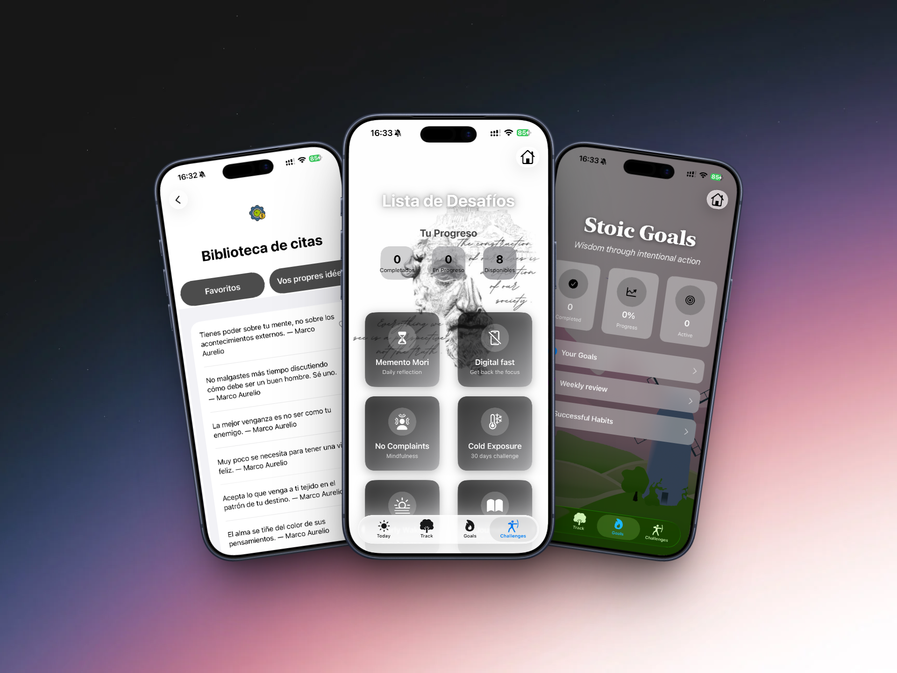
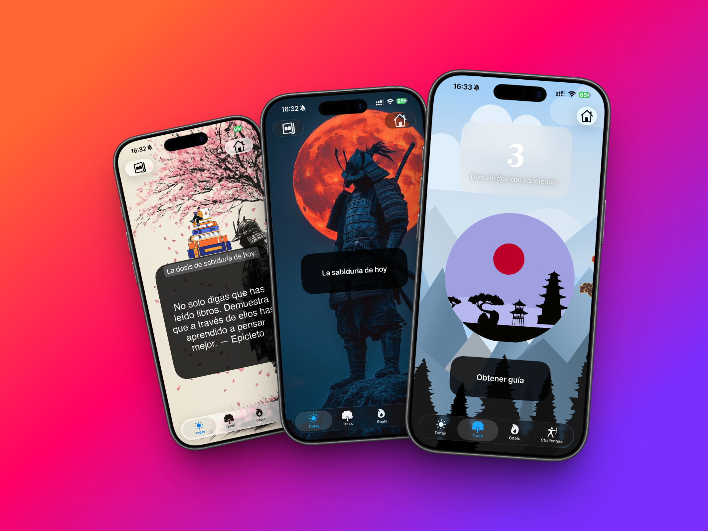
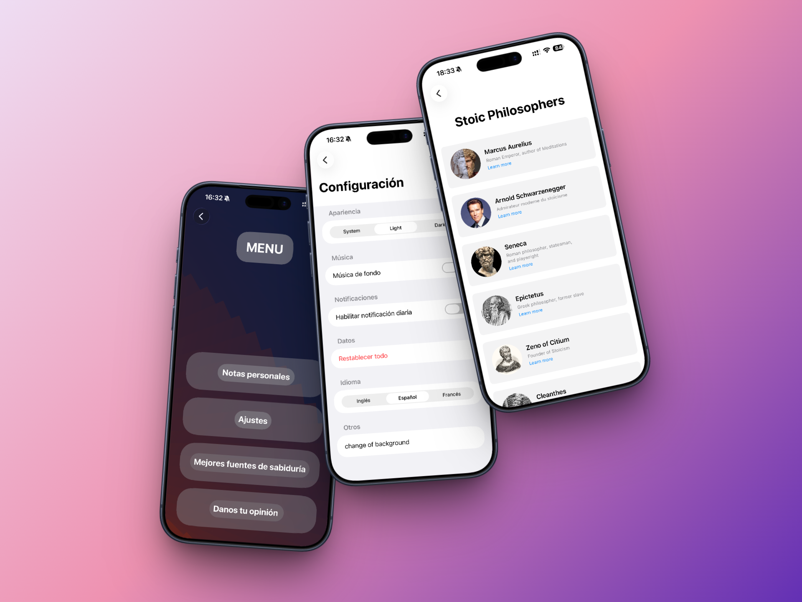

# 🇨🇭 Motivation 🇨🇭

**Motivation** is an iOS app that helps users cultivate a stoic mindset through daily wisdom, habit tracking, challenges, and intentional goal setting.  
This project was developed as my first solo iOS project, blending modern development with ancient philosophy.

---

## 📸 Screenshots

<p align="center">
  
  
  
</p>
<p align="center">
  <em>Today View &nbsp;&nbsp;&nbsp;&nbsp;&nbsp; Challenges View &nbsp;&nbsp;&nbsp;&nbsp;&nbsp; Goals View</em>
</p>

---

## 🏛️ Project Vision

> *This isn't just a habit tracker — it's a digital "Stoic mentor."*

The app helps users **bridge the gap** between knowing philosophy and living it through intentional action, daily tracking, and a curated library of wisdom.

---

## ✨ Features

Here's what you can do with Motivation:

- **Daily Wisdom** – Receive a daily stoic quote and guidance to start your day with intention.
- **Mindful Days Counter** – Track how many days you've lived with purpose and awareness.
- **Stoic Challenges** – Engage in 8 transformative challenges (*Memento Mori*, *Digital Fast*, *Cold Exposure*) with progress tracking and daily tasks.
- **Goals System** – Set and track personal goals across categories like Character, Career, Health, and Relationships, guided by stoic principles.
- **Weekly Stoic Review** – Reflect on your week with structured journaling prompts inspired by Stoic philosophy.
- **Habits Library** – Explore the 7 Stoic Habits aligned with the *7 Habits of Highly Effective People*.
- **Personal Notes** – Save your own reflections and favorite quotes.
- **Dark / Light Mode** – Supports system theme or manual override.
- **Multilingual** – Available in English, Spanish, and French.

---

## 🛠️ Tech Stack

| Technology | Purpose |
|-----------|---------|
| **SwiftUI** | 100% Declarative UI framework |
| **MVVM** | Architecture with `@StateObject` & `@Published` for reactive updates |
| **UserDefaults & @AppStorage** | Lightweight, reliable local data persistence |
| **Lottie** | Smooth animations and visual engagement |
| **Combine** | Reactive state management |
| **LocalizationBundle** | Full support for English, Spanish, and French |

---

## 📖 The Process

I started by designing the core navigation with a **TabView** and custom tab bar to give users easy access to the main features: Today, Track, Challenges, and Goals.

Next, I built the **Challenges system**. Each challenge has its own progress tracking, daily tasks, and persistence using `UserDefaults`. I implemented a `ChallengeProgressManager` to handle starting, completing, and resetting challenges, ensuring data persists across app sessions.

Then came the **Goals system**. I created a `GoalManager` with support for categories, priorities, and progress tracking. Users can add, edit, and complete goals. The weekly review feature lets users reflect on their progress with guided stoic questions.

For the **daily wisdom feature**, I integrated a counter that tracks "mindful days" — users can only increment once per day. This was implemented with date checking logic to prevent multiple increments on the same day.

To make the experience immersive, I added **Lottie animations** throughout the app. Each animation is carefully chosen to reinforce the stoic theme — from the *Ninjato* sword animation when completing a mindful day to the animated backgrounds that change with light/dark mode.

**Localization** was a key challenge. I built a custom `LocalizationManager` with `LocalizationBundle` to allow language switching without restarting the app. All quotes and UI text are available in English, Spanish, and French.

Throughout development, I documented my learnings and decisions. This helped me understand not just *what* I built, but *why* I built it that way.

---

## 🧠 What I Learned

During this project, I picked up important skills and gained a deeper understanding of iOS development:

### 🗂️ State Management with MVVM
- Using `@StateObject`, `@ObservedObject`, and `@Published` to manage app state across views
- Creating managers like `ChallengeProgressManager` and `GoalManager` to centralize logic

### 💾 Local Persistence
- Implementing `UserDefaults` with `@AppStorage` for seamless data persistence
- Storing and retrieving complex objects using `Codable` and `JSONEncoder`/`JSONDecoder`

### 🎨 Custom UI Components
- Building reusable components like `ButtonStyleSrt` and `IslandCard`
- Creating a consistent design system with theme support

### 🌍 Localization
- Building a custom localization system to support multiple languages
- Using `Bundle` switching to update language at runtime

### 🧪 Animation Integration
- Working with **Lottie** to add smooth, engaging animations
- Controlling playback modes and responding to animation completion events

### ⚛️ Reactivity and Combine
- Understanding how `@Published` and `ObservableObject` trigger view updates
- Using `@AppStorage` for reactive preferences

### 🎯 Logic and Math
- Calculating progress percentages, streaks, and averages
- Implementing "one increment per day" logic with date checking

---

## 🚀 How Can It Be Improved?

- Add **push notifications** for daily reminders and challenge updates
- Implement **iCloud sync** to backup user data across devices
- Add more **challenges** (e.g., *Morning Routine*, *Gratitude Practice*)
- Add **social features** like sharing progress or competing with friends
- Add **more animations** for feedback (e.g., haptic feedback on goal completion)
- Create a **widget** for the home screen showing daily quote or mindful days count
- Add **Apple Watch** companion app for quick check-ins

---

## 🏃‍♂️ Running the Project

To run the project in your local environment, follow these steps:

1. **Clone the repository** to your local machine:
   ```bash
   git clone https://github.com/Leonardo-jfk/Motivation-App.git
   Open the project in Xcode 19+:

2. cd Motivation-App
   open Motivation.xcodeproj

3. Install dependencies – Lottie is managed via Swift Package Manager (SPM). Xcode will automatically resolve it.
   Select a target (simulator or physical device) and press Run (⌘R) to start the app.

## 📜 Quote to Remember

“Waste no more time arguing what a good man should be. Be one.”
— Marcus Aurelius
## 🙏 Acknowledgments

The Stoic community – for keeping timeless wisdom alive

LottieFiles – for beautiful, free animations

AI tools – for accelerating learning and code structure during this solo journey

## ⭐ If this project inspires you, consider giving it a star on GitHub!

