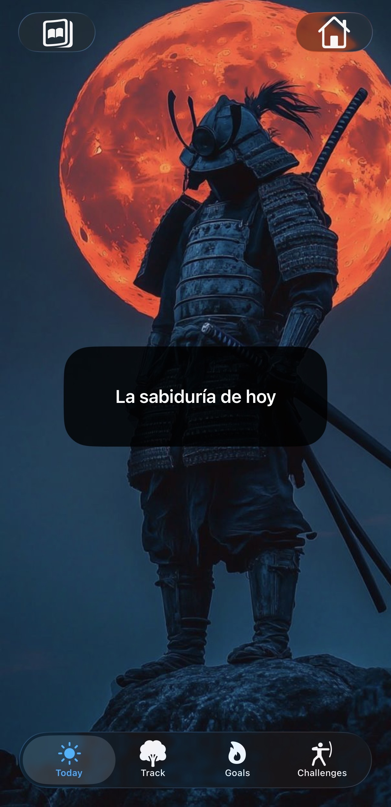

Motivation: A Stoic Path to Discipline
Welcome to Motivation, a SwiftUI-based iOS application designed to integrate ancient Stoic wisdom into modern daily life. This project was born from a solo journey of exploring philosophy, assisted by AI to bring complex ideas into a functional, aesthetic mobile experience.

🏛️ Project Vision
This isn't just a habit tracker; it's a digital "Stoic mentor." The app helps users bridge the gap between knowing philosophy and living it through intentional action, daily tracking, and a curated library of wisdom.

✨ Key Features
Stoic Goal System: Categorize your life's ambitions into Stoic virtues like Character & Virtue, Health & Discipline, and Learning & Wisdom.

Daily Practice Tracker: A "Days lived mindfully" counter that rewards consistency.

Interactive Quote Library: Explore translated quotes (English, Spanish, French) and save your favorites or personal reflections.

The 7 Habits of Stoicism: A guided framework connecting modern productivity habits with ancient principles like the Dichotomy of Control and Memento Mori.

Dynamic Wisdom Sources: Direct links and biographies of major Stoic figures, from Marcus Aurelius to modern practitioners like James Stockdale.

Immersive Experience:

Lottie Animations: Smooth, high-quality visual feedback (e.g., the "Ninjato" completion animation).

Ambient Audio: Integrated background music management to help you focus or meditate.

Customizable Themes: Supports system, light, and dark modes with unique animated backgrounds for each.

🛠️ Technical Stack
Framework: SwiftUI (100% Declarative UI)

Architecture: MVVM (Model-View-ViewModel) with @StateObject and @Published for reactive updates.

Persistence: UserDefaults and @AppStorage for lightweight, reliable local data saving.

Localization: Full support for English, Spanish, and French via a custom LocalizationBundle.

Animations: Lottie for iOS.

🧠 The "Solo + AI" Journey
This was my first major project. As a solo developer, I used AI as a "pair programmer" to:

Architect the Goal System: Logic for tracking progress and calculating average completion rates.

Refine Localization: Implementing a custom system to switch languages on the fly without restarting the app.

Debug Complex UI: Creating reusable components like the ButtonStyleSrt to maintain a consistent aesthetic across the app.

🚀 Getting Started
Clone the repository.

Open the project in Xcode 15+.

Ensure you have the Lottie package dependency installed.

Build and run on an iPhone simulator or physical device.

“Waste no more time arguing what a good man should be. Be one.” — Marcus Aurelius

## 🛠️ Tech Stack

| Technology         | Purpose                                      |
|--------------------|----------------------------------------------|
| SwiftUI            | Modern declarative UI framework               |
| Lottie             | Smooth animations and visual engagement       |
| Combine            | Reactive state management                     |
| UserDefaults       | Local persistence for user preferences & data |
| AsyncStorage       | (React Native version)                        |
| Xcode              | Development environment                       |

---

## 📸 Screenshots

| Today View | Challenges View | Goals View |
|------------|----------------|------------|
|  |  |  |

## 📸 Screenshots

  
  
  

